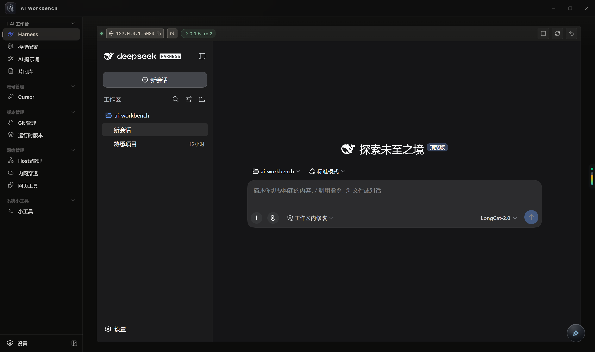

# AI Workbench (AI 工作台)

基于 **Tauri v2 + React + Rust/SQLite** 的 Windows 桌面应用，定位为 **AI 驱动的开发工具箱**。核心是 **DeepSeek 本地服务**，辅以模型配置、提示词优化、Git / Cursor 多身份管理，以及 Hosts、内网穿透、网页工具等能力。

## 效果图



### 应用图标

- 设计母版：[`docs/brand/logo-silver.png`](docs/brand/logo-silver.png)（默认冷银）、[`docs/brand/logo-ice.png`](docs/brand/logo-ice.png)（冰蓝备选）
- 打包默认：`src-tauri/icons/icon.png` / `icon.ico`
- 侧栏 / 加载屏：`src/assets/logo-silver.png`（`AppLogoMark`）

重新生成 Tauri 图标（使用母版 PNG）：

```bash
npx @tauri-apps/cli icon docs/brand/logo-silver.png
npx @tauri-apps/cli icon docs/brand/logo-ice.png -o src-tauri/icons/ice
```

## 功能特性

### AI 工作台

- **Harness**：启动/停止本地 `@deepseek-ai/dsh`，iframe 内嵌 Web UI；侧栏切走后保活；自定义启动端口；浏览器打开
- **快问**：托盘常驻；默认 `Ctrl+Alt+K`；桌面浮漂；流式问答；多轮追问 / 重新生成；可选工作区 / Git / Dirty / 剪贴板上下文
- **模型配置**：多厂商与 OpenAI 兼容接口；增删改查、连接测试、批量测试/同步/删除、分组视图、同步 DSH
- **AI 提示词**：基于已配置模型改写提示词
- **片段库**：本地 CRUD，`{{param}}` 替换后复制或插入快问；JSON 导入导出、克隆、实时预览

### 账号与 Git

- **Cursor**：多账号一键切换（每账号独立 `--user-data-dir`，登录态互不影响）；工作区 / 历史 / 扩展 / Agent 数据 / Composer 会话跨账号共享；磁盘占用可视化 + DB 瘦身（共享层重建 + VACUUM）；可联动 Git，可选本机密码备忘，支持诊断导出
- **Git 管理**：仓库总览 / 扫描 / 搜索 / 批量身份 / 批量拉推 / 批量移除；提交页多仓变更、diff、提交与推送、AI 生成说明

### 开发环境

- **版本切换**：本机开发运行时相关能力

### 系统工具

- **Hosts管理**：读写系统 hosts，手动/自动备份与恢复，另存为配置（需管理员）
- **内网穿透**：cloudflared 临时/命名隧道；日志过滤/导出；公网 URL 浏览器打开；详见 [docs/cloudflared.md](docs/cloudflared.md)
- **网页工具**：添加 http(s) 链接，独立窗口打开

### 设置

- 主题：冰蓝 / 冷银 / 香槟金 / 浅色 / 深色 / 跟随系统
- 中英语言、侧栏折叠、开机自启、快问快捷键
- 数据导出 / 导入（JSON；含明文密钥警告）

## 侧边栏导航

```
AI 工作台
├── Harness
├── 模型配置
├── AI 提示词
└── 片段库

账号与 Git
├── Cursor
└── Git 管理

开发环境
└── 版本切换

系统工具
├── Hosts管理
├── 内网穿透
└── 网页工具

设置
```

## 技术栈

| 层 | 技术 |
|---|---|
| 前端 | React 18 + TypeScript + Vite 5 |
| 后端 | Tauri v2 + Rust |
| 持久化 | SQLite（`rusqlite` bundled） |
| 状态 | Zustand 5 |
| 样式 | 纯 CSS（`data-theme`） |
| i18n | i18next |

## 快速开始

### 环境要求

- Node.js 18+
- Rust 1.70+
- Windows 10/11
- WebView2（Win10/11 通常已预装）

### 安装与开发

在仓库根目录执行（不要写死本机盘符路径）：

```bash
git clone <repo-url>
cd ai-workbench
npm install
npm run tauri -- dev
```

仅前端 Vite（无桌面壳）：

```bash
npm run dev
```

调试构建出的 exe（相对路径）：

```powershell
npm run tauri -- build -- --debug
Start-Process .\src-tauri\target\debug\ai_workbench.exe
```

## 打安装包（Windows exe）

发布前先**同步版本号**（三处保持一致）：

| 文件 | 字段 |
|------|------|
| `package.json` | `"version"` |
| `package-lock.json` | `"version"`（2 处，随 `npm install` 写入） |
| `src-tauri/tauri.conf.json` | `"version"` |
| `src-tauri/Cargo.toml` | `version`（`src-tauri/Cargo.lock` 未被 git 跟踪，构建时自动更新） |

当前版本：`0.1.1`（设置页通过 Tauri `getVersion()` 读取）。

### 构建

```bash
npm install
npm run tauri -- build
```

### 产物位置

| 类型 | 路径 |
|------|------|
| NSIS 安装包 | `src-tauri/target/release/bundle/nsis/*.exe` |
| MSI（若生成） | `src-tauri/target/release/bundle/msi/` |
| 便携 exe | `src-tauri/target/release/ai_workbench.exe` |

`tauri.conf.json` 中 `bundle.targets` 为 `all` 时会尝试生成常见 Windows 安装格式；日常分发优先使用 **NSIS 安装包**。

### 分发注意

- **开发标识零泄漏（打包红线）**：所有开发标识——主窗口标题 `[DEV]` 后缀（`src-tauri/src/lib.rs`，`cfg!(debug_assertions)`）、托盘提示 `[DEV]` 前缀（`src-tauri/src/tray/mod.rs`）、前端 DEV 徽标（`src/App.tsx`，`import.meta.env.DEV`）——必须是**编译期常量**，`npm run tauri -- build`（release）自动剥离；禁止改用运行时环境变量 / 配置文件 / 命令行开关控制开发标识，新增开发态 UI 一律沿用上述两处编译期机制，发版前抽查安装包运行无任何 `[DEV]` / DEV 徽标
- 需要目标机器具备 **WebView2**
- DeepSeek 功能仍依赖本机 **Node.js + npm**（全局 `@deepseek-ai/dsh`）
- 内网穿透依赖本机 `cloudflared`（应用内可安装或指定 exe）
- 修改 Hosts 需**管理员**运行
- **不要**把用户数据目录打包进安装包：`%APPDATA%\com.ai-workbench.app\`（含 SQLite 与明文密钥）
- 安装包本身不包含用户的 API Key / Token；用户数据在首次运行后写入本机

## 隐私说明

- API Key、Tunnel Token、Cursor 密码备忘等保存在本机 SQLite：`%APPDATA%\com.ai-workbench.app\ai-workbench.db`
- 不会上传密钥；请勿分享数据库或导出的含密钥 JSON

## 免责声明

- 本项目为个人开发的本地工具，与 DeepSeek、Cloudflare、Cursor 等厂商**无任何隶属或合作关系**；相关名称与图标仅用于描述兼容对象，版权归原作者所有
- 「DSH 认证补丁」会修改本机 DeepSeek Harness 安装目录下的文件以跳过浏览器登录，**可能违反上游服务条款**；请自行评估风险，也可在 DeepSeek 页使用「还原认证补丁」恢复原始文件
- Hosts 修改、内网穿透等功能仅供合法用途，使用者需遵守当地法律法规
- 使用本项目产生的任何直接或间接风险由使用者自行承担

## 项目结构（摘要）

```
ai-workbench/
├── src/                 # React 前端（App、components、core、locales）
├── src-tauri/           # Tauri + Rust 命令（见 src/lib.rs invoke_handler）
├── docs/                # 截图、品牌图、专题文档
├── package.json
└── README.md
```

后端命令按模块拆分于 `src-tauri/src/*_commands.rs`，完整列表以 `src-tauri/src/lib.rs` 注册为准。

`src-tauri/src/bin/` 下是内部诊断工具（`cursor_switch_test`）。它们由 `dev-tools` 特性门控，**默认不参与构建**，因此不会被打进安装包；需要时用 `cargo build --features dev-tools` 单独编译。

## 已知限制

1. 目前仅面向 **Windows**
2. 完整 AI 对话主要走 DeepSeek Harness；快问为轻量单发
3. DeepSeek / cloudflared 依赖本机环境
4. 敏感字段本机明文存储（见隐私说明）
5. Git 提交页基于收藏仓库扫描

## 许可

MIT
