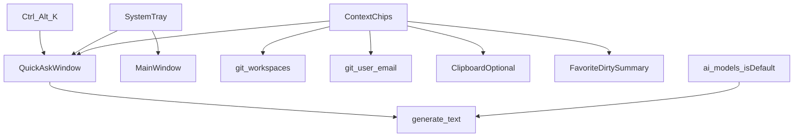

# 工作台升级计划（阶段 8：AI 随手可及）

> 状态：✅ M1/M2/M3 已落地
> 定稿依据：功能满足度评估 + 原提案评审（砍掉 uTools 化膨胀，补上上下文流入）
> 范围原则：遵守 ROADMAP「明确不做」（不做内置流式对话页 / 不做 AI agent 循环 / 仅 Windows / 不做深插件）

---

## 一、合理性结论

| 原提案内容 | 判定 | 定稿处置 |
|---|---|---|
| 托盘 + 全局快捷键 + 快问窗 | 合理，对准日活 | **必做（M1）** |
| 快问复用 `generate_text`、单发非流式 | 合理，守边界 | **采用** |
| 「上下文不流动」诊断 | 准确 | **M1 必须治理**（原提案只写了诊断未落方案） |
| 剪贴板历史 + 8 小工具 + 端口杀进程 | 合理作启动器，不合理作本产品主线 | **移出阶段 8** |
| 片段库 | 有用但非日活验证关键 | **M3 可选** |
| 托盘运行态 + 数据导出 | 合理 | **M2 必做** |
| HTTP 客户端 | 与现有测连/外部工具重叠 | **不做** |
| 整包 11–16 天五 Phase | 偏宽、易稀释差异化 | **收成 3 个里程碑，约 6–9 天** |

**产品判断**：阶段 8 只做一件事——让 AI 从「侧栏深处的页」变成「全局一键可触达的服务」，并让应用已有的 Git/工作区上下文能流进这次提问。不做第二套工具合集。

---

## 二、目标

**一句话：任意界面 ≤1s 唤起快问；提问可附带本机工作台上下文；关窗不退出、托盘可见后台。**

验收口诀：每加功能问——「是否让用户更愿意每天按一次快捷键？」

---

## 三、最终范围（三里程碑）

```text
M1  AI 随手可及 + 上下文芯片     ← 阶段 8 核心，先交付
M2  托盘运行态 + 数据导出/导入   ← 紧随其后
M3  片段库（精简）               ← 有余力再做；可整段砍掉
────────────────────────────────
明确不做（阶段 8）
  · 完整剪贴板历史管理器
  · JSON/Base64/JWT/正则等小工具集
  · 端口/进程 kill 页
  · HTTP 客户端
  · 快问多轮对话页 / Agent
  · 数据库加密（导出仅强警告）
```



---

## 四、M1 — 托盘 + 快捷键 + 快问 + 上下文芯片

**工期：4–5 天（单人）**

### 4.1 系统托盘

| 项 | 定稿方案 |
|---|---|
| 技术 | Tauri v2 `tray-icon` feature；新模块 `src-tauri/src/tray.rs` |
| 菜单 | 显示主窗 / 打开快问 / 启动·停止 DSH / 退出 |
| 关主窗 | 拦截关闭 → `app.hide()`，进程留在托盘 |
| 轮询 | 5s 刷新 DSH / 隧道状态（供 tooltip；菜单打开时读最新） |

### 4.2 全局快捷键

| 项 | 定稿方案 |
|---|---|
| 插件 | `tauri-plugin-global-shortcut` v2 |
| 默认键 | `Ctrl+Alt+K`（可在设置页改） |
| 行为 | 显示/隐藏快问窗；注册失败必须在设置页提示，禁止静默失败 |
| 存储 | `workbench-settings`（Zustand persist） |

### 4.3 迷你快问窗

| 项 | 定稿方案 |
|---|---|
| 窗口 | `label: quick-ask`；无边框、置顶、不进任务栏、默认隐藏；约 560×480 |
| 前端 | `main.tsx` 按 hash `#/quick-ask` 渲染 `QuickAskApp`（与主 `App` 分离） |
| 模型 | 默认 `ai_models` 中 `isDefault`，窗内可切换 |
| 发送 | 复用现有 `generate_text`；Enter 发送；Esc 隐藏（不销毁，保留本次输入与上次回答） |
| 回答操作 | 复制；「在主窗打开 DeepSeek」（**不是**模型配置页） |
| 剪贴板 | 唤起时可一键「填入剪贴板」（默认开，设置可关）；**不做历史库** |

### 4.4 上下文芯片（原提案缺口补齐）

快问窗顶部可选芯片（多选，默认勾选「剪贴板」关闭、「工作区」开启若存在）：

| 芯片 | 数据来源 | 注入方式 |
|---|---|---|
| 当前工作区 | `git_workspaces` 最近使用 / 用户上次选择；无则隐藏 | system 或 user 前缀短文本 |
| Git 身份 | 当前全局或最近仓 `user.name` / `user.email` | 一行摘要 |
| Dirty 摘要 | 收藏仓 `git_repo_summary` 节流结果，最多 5 条「路径 + 改动数」 | 截断文本，总长硬上限（如 2KB） |
| 剪贴板 | 唤起瞬间文本 | 用户可取消勾选 |

约束：

- 仍是**单发**任务，不是多轮会话
- 上下文只作 prompt 附件，不执行工具、不改仓库
- 超长自动截断并 UI 提示「已截断」

结构化任务模板（下拉，可选）：无 / 报错诊断 / 解释这段 / 润色文案——仍走同一 `generate_text`，仅换 system prompt。

### 4.5 流式（不进 M1）

v1 非流式。若上线后反馈强，再开 **M1.5**：`generate_text_stream` + 事件 `quick-ask-chunk`。

### 4.6 M1 实施顺序

1. `tray.rs` + 关窗进托盘 + 菜单显示主窗/退出  
2. 全局快捷键 + `quick-ask` 窗口骨架  
3. `QuickAskApp`：模型选择 / 发送 / Esc / 复制  
4. 上下文芯片 + 剪贴板填入  
5. 托盘接入 DSH 启停与基础 tooltip  
6. 设置页快捷键配置 + i18n  
7. README / 交接 / ROADMAP 同步  

### 4.7 M1 验收

- [ ] 托盘常驻；关主窗不退出  
- [ ] `Ctrl+Alt+K` ≤1s 呼出快问；Esc 隐藏后内容保留  
- [ ] 默认模型一问一答；答案可复制  
- [ ] 至少一种上下文芯片可勾选并出现在实际请求中  
- [ ] 热键冲突有明确 UI 提示  
- [ ] 不修改 ROADMAP 禁止项；`generate_text` 可原样复用  

---

## 五、M2 — 托盘运行态完善 + 数据导出/导入

**工期：1.5–2 天**

### 5.1 托盘运行态

- Tooltip：`DSH :端口 · 隧道 xN`（无则「DSH 未运行」）  
- 菜单动态段：活跃隧道名称；点击复制 URL（若有）  
- 与 M1 托盘模块同一处演进，不新开并行架构  

### 5.2 数据导出 / 导入

| 项 | 定稿方案 |
|---|---|
| 导出 | 全表白名单 dump → 用户选路径 JSON |
| 导入 | 校验后整库替换；**二次确认** |
| 警告 | 导出弹窗固定文案：含 API Key / Token 明文，勿分享 |
| 入口 | 设置页「数据管理」；托盘可选「导出」 |

不做加密 zip（阶段 8 范围外）。

### 5.3 M2 验收

- [ ] Tooltip / 菜单反映真实 DSH 与隧道状态  
- [ ] 导出含警告；导入往返一致；导入有二次确认  

---

## 六、M3 — 片段库（可选）

**工期：1.5–2 天；可整体取消而不影响 M1/M2 成功标准**

| 项 | 定稿方案 |
|---|---|
| 表 | `snippets`（name, content, tags, params, use_count, timestamps） |
| 模板 | `{{param}}` → 填写面板 → 复制 |
| UI | 侧栏「片段」一页；种子 5 个常用模板 |
| 与快问 | 快问输入区可「插入片段」（轻联动即可） |

**不做**：剪贴板历史表、云同步、URL 批量导入。

---

## 七、技术清单（定稿）

### 7.1 新依赖

- `tauri` feature：`tray-icon`
- `tauri-plugin-global-shortcut = "2"` + `@tauri-apps/plugin-global-shortcut`

### 7.2 新模块 / 命令

| 命令或模块 | 里程碑 |
|---|---|
| `tray.rs`（托盘生命周期 / 菜单 / tooltip） | M1→M2 |
| 快捷键 register / unregister | M1 |
| 快问窗 create/show/hide（conf + 前端） | M1 |
| 上下文组装：前端拼 prompt 即可；必要时 `git_repo_summary` 已有则复用 | M1 |
| `export_data` / `import_data` | M2 |
| `snippets` 表 + CRUD（仅 M3） | M3 |

### 7.3 新表

| 表 | 里程碑 |
|---|---|
| 无（M1/M2 不强制新表；工作区等复用现表） | M1/M2 |
| `snippets` | 仅 M3 |

剪贴板历史表、`http_requests` 表：**不建**。

### 7.4 关键文件（预期）

- `src-tauri/src/tray.rs`
- `src/components/QuickAskApp.tsx`（或 `src/quick-ask/`）
- `src/main.tsx` hash 分支
- `src/locales/{zh-CN,en-US}/quickask.json`、`tray.json`
- 设置页快捷键 + 数据管理段
- 文档：`ROADMAP.md` 阶段 8、`README.md`、`交接文档.md`

---

## 八、已锁定决策

| # | 决策 | 锁定值 |
|---|---|---|
| 1 | 默认热键 | `Ctrl+Alt+K`，可配置 |
| 2 | 快问交互 | 单发；无多轮 |
| 3 | 流式 | M1 不做；按反馈开 M1.5 |
| 4 | 剪贴板 | 仅唤起填入；无历史库 |
| 5 | 小工具 / 端口 / HTTP | 阶段 8 不做 |
| 6 | 导出格式 | 明文 JSON + 强警告 |
| 7 | 「展开」目标 | 主窗 DeepSeek 页，非模型配置 |
| 8 | 片段库 | M3 可选，默认排期但可砍 |

---

## 九、风险与边界

| 风险 | 缓解 |
|---|---|
| 热键与其它启动器冲突 | 可配置 + 注册失败提示 |
| 第二 Webview 内存 | 隐藏不销毁；不反复 create |
| 上下文过大拖慢/费 token | 硬上限截断 + UI 提示 |
| Dirty 摘要刷新成本 | 复用现有摘要 TTL/并发限制；失败则芯片灰显 |
| 关窗进托盘用户以为已退出 | 首次提示一次「已最小化到托盘」 |

严格不做：内置多模型流式对话页、Agent、多平台、DB 加密、剪贴板跨设备。

---

## 十、总览与成功标准

| 里程碑 | 主题 | 工期 | 是否阻塞阶段 8 成功 |
|---|---|---|---|
| M1 | 托盘 + 快问 + 上下文芯片 | 4–5 天 | **是** |
| M2 | 托盘运行态 + 导入导出 | 1.5–2 天 | **是**（导出可视为软必须） |
| M3 | 片段库 | 1.5–2 天 | 否 |
| **合计** | | **6–9 天**（含 M3）/ **5.5–7 天**（不含 M3） | |

阶段 8 成功 = M1 + M2 验收通过，且用户能回答「我会为快问每天按快捷键」。

### 文档同步（每个里程碑结束时）

- 本文件标记对应里程碑 ✅  
- `ROADMAP.md` 增加阶段 8 入口  
- `README.md` / `交接文档.md` / i18n  

---

## 十一、Backlog（明确不在阶段 8）

若日后要做，另开阶段评估，不塞进本计划：

1. 剪贴板历史（默认 off、隐私开关、容量上限）  
2. 纯前端小工具集  
3. 端口监听 / kill  
4. HTTP 调试客户端  
5. 快问流式输出（可作为 M1.5）  
6. 独立「项目主页」聚合 UI（M1 上下文芯片已覆盖部分价值）  
